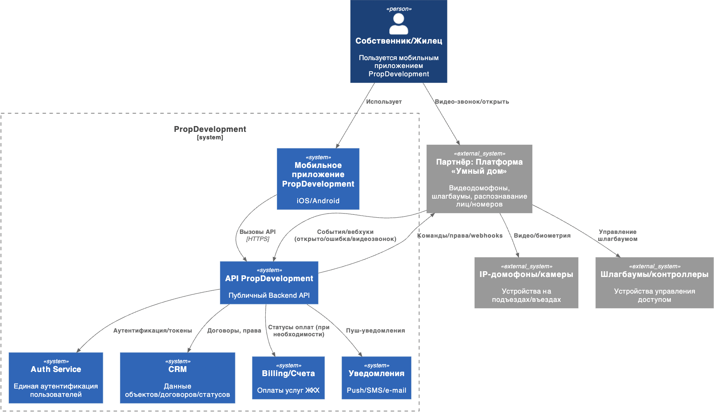
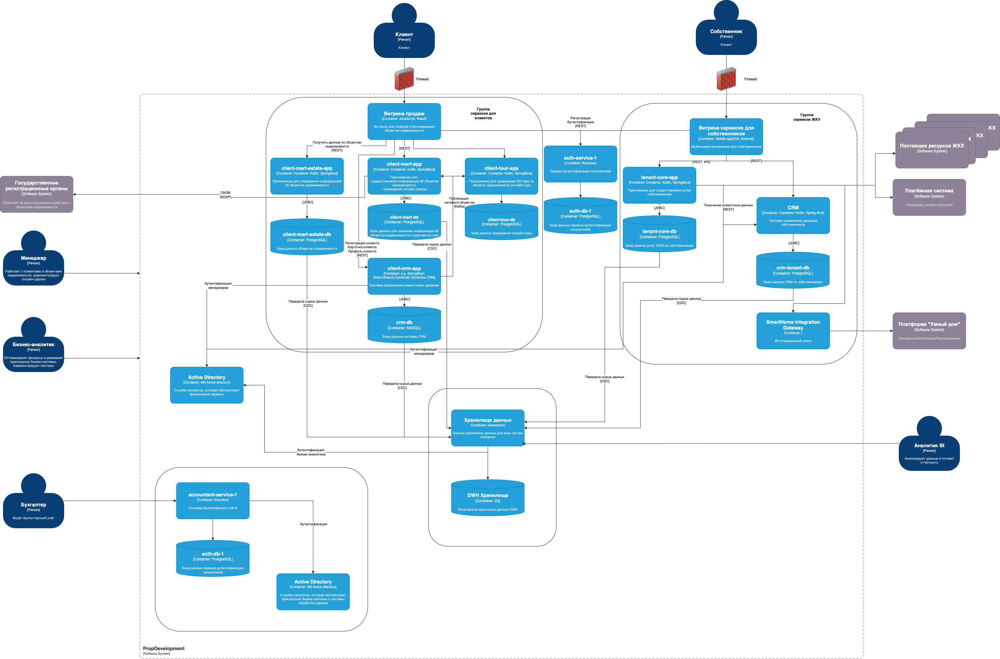

# Task 3

## Диаграмма контекста

## Обновленная С4 диаграмма

## Требования к внешней интеграции

1. Взаимная аутентификация
   - Все вызовы PropDevelopment - Партнёр выполняются только по защищённым каналам TLS 1.3 с обязательной проверкой сертификатов с обеих сторон
   - Сертификаты хранятся в защищённом KMS, ротация каждые 90 дней
2. Шифрование и целостность данных
   - Все команды ("открыть дверь", "въезд разрешён") и события подписываются цифровой подписью
3. Изоляция интеграции
   - Выделенный сервис-шлюз (SmartHome Integration Gateway) и отдельная база аудита
4. Аудит и трассировка
   - Каждое событие (команда, ответ, ошибка, вебхук) имеет trace_id
